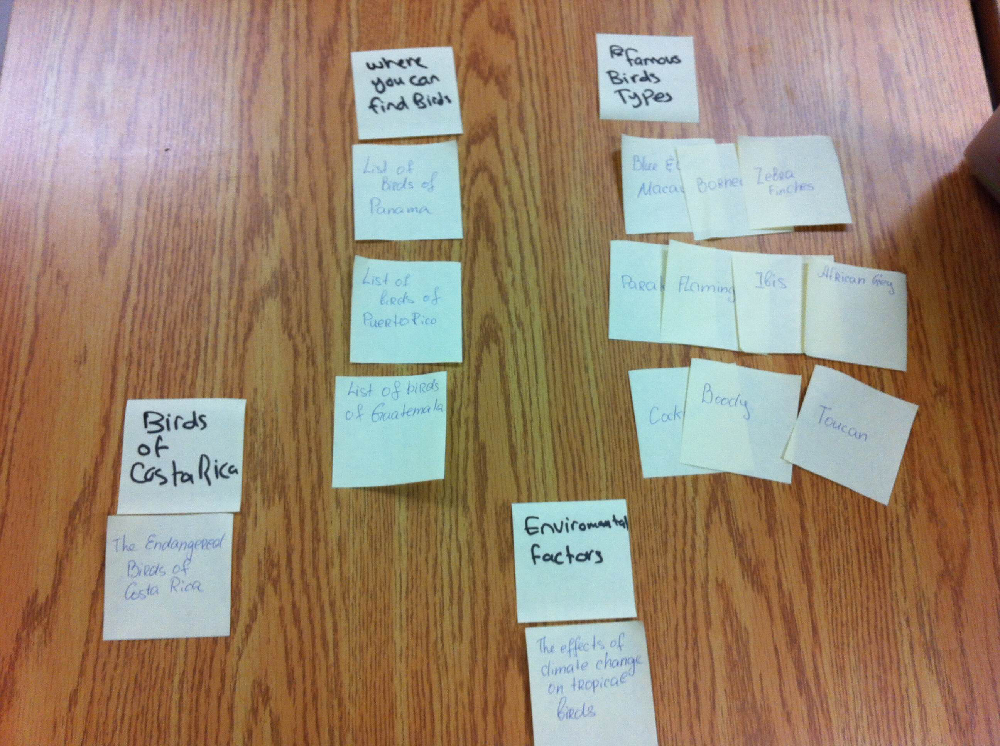
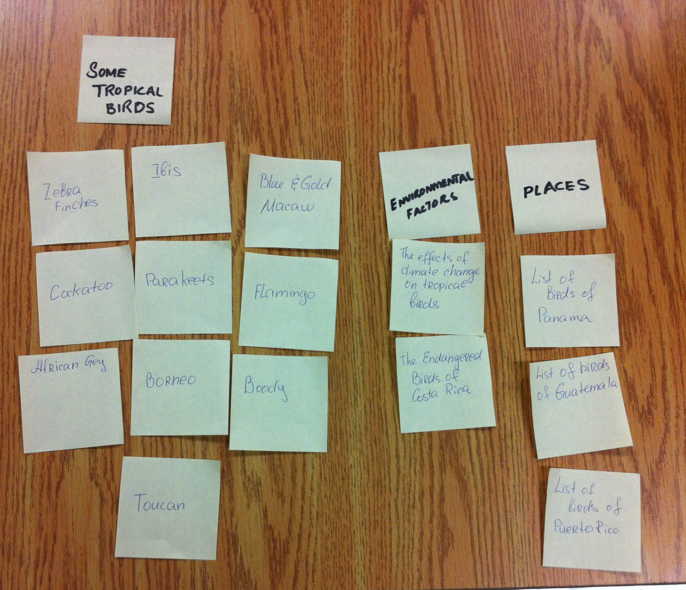

# Card sort report

The purpose of this card sort was to determine common navigation patterns and categories from the content of {your large data-oriented website}.

## Specifics

The card sort was conducted by Anna Odeh on September 10th, 2013 between the times of 4:30 and 4:45 with the following participants:

- Dima Badawi
- Sundus Asif

### Cards

15 cards were used covering a broad range of applicable content for the website. The following topics were used as cards:

1. Where you can find birds
2. Enviromental factors
3. Famous birds types
4. Some tropical birds
5. Enviromental factors
6. Places

## Card sort results

*Card sort 1 by Dima Badawi*

*Card sort 2 by Sundus Asif*

## Observations

- Did the participants have any common comments?
	- The participants had some questions about the choosed topic.
- Did they have questions that stood out?
	- No
- Did they struggle with certain articles or topics?
	- No
- Did they find common groupings? Or were the groupings completely different?
 	- Most of the goupings was the same for both participants
- Were some of the groupings completely unexpected?
	- No
- Were the results similar to your expectations?
 	- Yes
- How did you feel while watching them perform the task?
	 - Ok